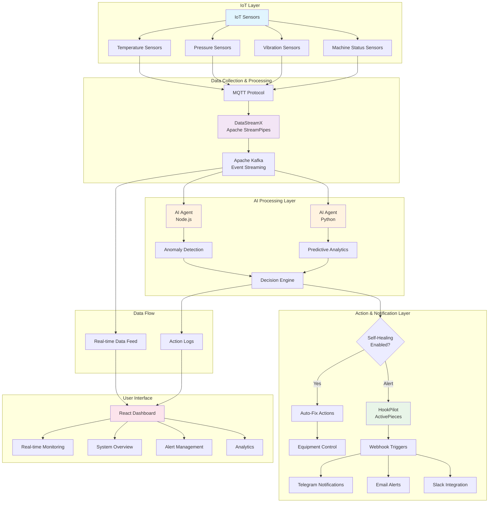

# COGNITIVE AI MANUFACTURING AGENT (IOT INDUSTRY AUTOMATION)

## 🚀 Overview

The Cognitive AI Manufacturing Agent is an intelligent industrial automation platform that leverages IoT sensors, real-time data processing, and AI-driven decision making to enable autonomous manufacturing operations with self-healing capabilities.

## 🏗️ Architecture & Tech Stack

### Core Components

- **DataStreamX** (Apache StreamPipes) - Real-time IoT data collection and processing
- **HookPilot** (ActivePieces) - Webhook-based notification and automation system
- **AI Agents** - Intelligent decision-making engines (Node.js & Python)
- **React Dashboard** - Real-time monitoring and control interface

## 📊 System Flow Architecture

## 🎯 Key Features

### 🤖 Autonomous Operations
- **Real-time Monitoring**: Continuous surveillance of manufacturing equipment
- **Predictive Maintenance**: AI-powered failure prediction and prevention
- **Self-Healing**: Automatic issue resolution without human intervention
- **Anomaly Detection**: Intelligent identification of operational irregularities

### 📡 Data Integration
- **MQTT Protocol**: Lightweight messaging for IoT device communication
- **Apache Kafka**: High-throughput event streaming and processing
- **Multi-sensor Support**: Temperature, pressure, vibration, and status monitoring
- **Real-time Processing**: Sub-second data processing and response times

### 🔔 Smart Notifications
- **Multi-platform Alerts**: Telegram, Email, Slack, and custom webhooks
- **Priority-based Routing**: Critical alerts get immediate attention
- **Contextual Information**: Rich notifications with actionable insights
- **Escalation Protocols**: Automatic escalation for unresolved issues

### 📈 Analytics & Insights
- **Performance Dashboards**: Real-time visualization of system metrics
- **Historical Analysis**: Trend analysis and pattern recognition
- **Operational Intelligence**: Data-driven insights for optimization
- **Custom Reports**: Tailored reporting for different stakeholders

## 🛠️ Technology Stack Details

| Component | Technology | Purpose |
|-----------|------------|---------|
| **Data Collection** | DataStreamX (Apache StreamPipes) | IoT data ingestion and stream processing |
| **Message Broker** | Apache Kafka | Event streaming and data pipeline |
| **Communication Protocol** | MQTT | Lightweight IoT device messaging |
| **AI Processing** | Node.js & Python | Machine learning and decision algorithms |
| **Automation Engine** | HookPilot (ActivePieces) | Workflow automation and integrations |
| **Frontend** | React.js | Interactive dashboard and user interface |
| **Database** | Time-series DB | Historical data storage and analytics |

## 🔄 Operation Workflow

1. **Data Acquisition**: IoT sensors continuously monitor manufacturing equipment
2. **Stream Processing**: DataStreamX processes incoming sensor data in real-time
3. **Event Generation**: Kafka distributes events to AI agents and dashboard
4. **AI Analysis**: Machine learning models analyze patterns and detect anomalies
5. **Decision Making**: AI agents determine appropriate actions based on analysis
6. **Automated Response**: Self-healing mechanisms execute corrective actions
7. **Notification**: HookPilot triggers alerts to relevant stakeholders
8. **Monitoring**: React dashboard provides real-time visibility and control

## 🚨 Alert Management

### Alert Categories
- **Critical**: Immediate equipment failure or safety issues
- **Warning**: Performance degradation or maintenance needed
- **Info**: Status updates and operational changes

### Response Actions
- **Automatic**: AI-driven self-healing and optimization
- **Semi-automatic**: Suggested actions requiring approval
- **Manual**: Human intervention required

## 📋 System Requirements

### Hardware
- IoT sensors compatible with MQTT protocol
- Edge computing devices for local processing
- Network infrastructure for real-time communication

### Software
- Node.js runtime environment
- Python 3.8+ with ML libraries
- Apache Kafka cluster
- React.js development environment

## 🎥 Demo & Tutorial

This system enables:
- **Zero-downtime Manufacturing**: Proactive issue resolution
- **Cost Optimization**: Reduced maintenance and operational costs
- **Quality Assurance**: Consistent product quality through monitoring
- **Scalability**: Easy integration of new equipment and sensors

## 📞 Support & Documentation

For detailed setup instructions, API documentation, and troubleshooting guides, please refer to the individual component documentation or contact the development team.

---

*Built with ❤️ for the future of smart manufacturing*
