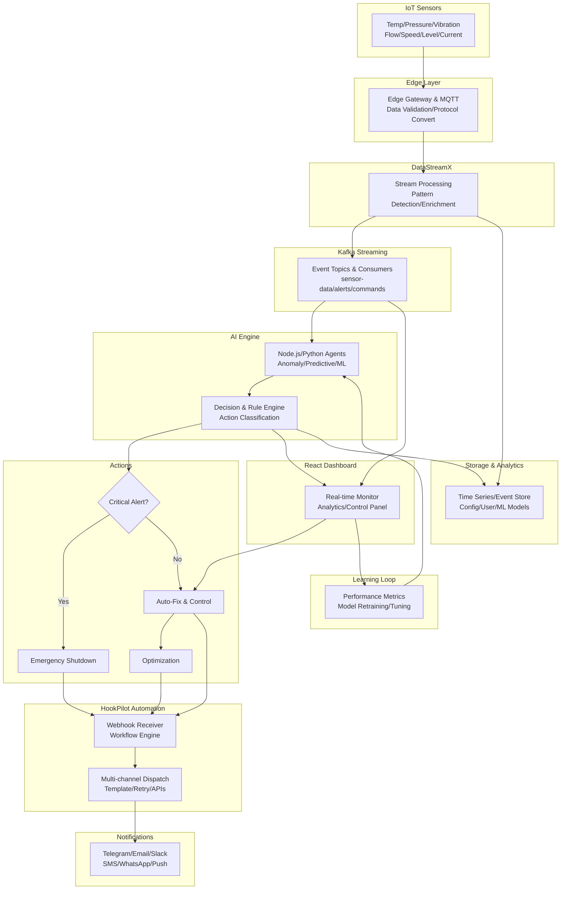

# Cognitive AI Manufacturing Agent (IoT Industry Automation)

```mermaid
graph TB
    subgraph "IoT Sensors"
        A[Temp/Pressure/Vibration<br/>Flow/Speed/Level/Current]
    end
    
    subgraph "Edge Layer"
        B[Edge Gateway & MQTT<br/>Data Validation/Protocol Convert]
    end
    
    subgraph "DataStreamX"
        C[Stream Processing<br/>Pattern Detection/Enrichment]
    end
    
    subgraph "Kafka Streaming"
        D[Event Topics & Consumers<br/>sensor-data/alerts/commands]
    end
    
    subgraph "AI Engine"
        E[Node.js/Python Agents<br/>Anomaly/Predictive/ML]
        F[Decision & Rule Engine<br/>Action Classification]
    end
    
    subgraph "Actions"
        G{Critical Alert?}
        H[Emergency Shutdown]
        I[Auto-Fix & Control]
        J[Optimization]
    end
    
    subgraph "HookPilot Automation"
        K[Webhook Receiver<br/>Workflow Engine]
        L[Multi-channel Dispatch<br/>Template/Retry/APIs]
    end
    
    subgraph "Notifications"
        M[Telegram/Email/Slack<br/>SMS/WhatsApp/Push]
    end
    
    subgraph "React Dashboard"
        N[Real-time Monitor<br/>Analytics/Control Panel]
    end
    
    subgraph "Storage & Analytics"
        O[Time Series/Event Store<br/>Config/User/ML Models]
    end
    
    subgraph "Learning Loop"
        P[Performance Metrics<br/>Model Retraining/Tuning]
    end
    
    A --> B --> C --> D
    D --> E --> F --> G
    G -->|Yes| H
    G -->|No| I --> J
    H --> K
    I --> K
    J --> K
    K --> L --> M
    D --> N
    F --> N
    N --> I
    C --> O
    F --> O
    N --> P --> E
```
