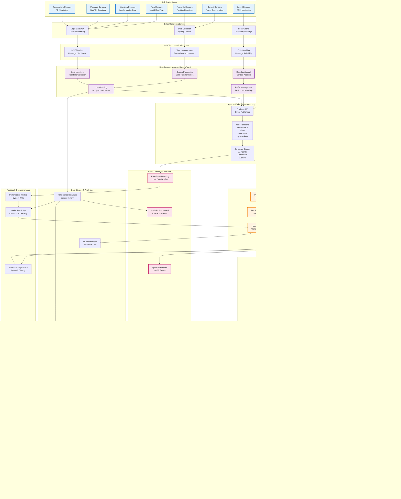

# COGNITIVE AI MANUFACTURING AGENT (IOT INDUSTRY AUTOMATION)

```mermaid
graph TB
    %% IoT Device Layer
    subgraph "IoT Device Layer"
        A1[Temperature Sensors<br/>°C Monitoring]
        A2[Pressure Sensors<br/>Bar/PSI Readings]
        A3[Vibration Sensors<br/>Accelerometer Data]
        A4[Flow Sensors<br/>Liquid/Gas Flow]
        A5[Proximity Sensors<br/>Position Detection]
        A6[Current Sensors<br/>Power Consumption]
        A7[Speed Sensors<br/>RPM Monitoring]
        A8[Level Sensors<br/>Tank/Container Levels]
    end
    
    %% Edge Computing Layer
    subgraph "Edge Computing Layer"
        B1[Edge Gateway<br/>Local Processing]
        B2[Data Validation<br/>Quality Checks]
        B3[Local Cache<br/>Temporary Storage]
        B4[Protocol Conversion<br/>Modbus/OPC-UA to MQTT]
    end
    
    %% Communication Protocol Layer
    subgraph "MQTT Communication Layer"
        C1[MQTT Broker<br/>Message Distribution]
        C2[Topic Management<br/>Sensor/alerts/commands]
        C3[QoS Handling<br/>Message Reliability]
        C4[Security Layer<br/>TLS/SSL Encryption]
    end
    
    %% DataStreamX Processing Layer
    subgraph "DataStreamX (Apache StreamPipes)"
        D1[Data Ingestion<br/>Real-time Collection]
        D2[Stream Processing<br/>Data Transformation]
        D3[Data Enrichment<br/>Context Addition]
        D4[Pattern Detection<br/>Anomaly Identification]
        D5[Data Routing<br/>Multiple Destinations]
        D6[Buffer Management<br/>Peak Load Handling]
    end
    
    %% Apache Kafka Event Streaming
    subgraph "Apache Kafka Event Streaming"
        E1[Producer API<br/>Event Publishing]
        E2[Topic Partitions<br/>sensor-data<br/>alerts<br/>commands<br/>system-logs]
        E3[Consumer Groups<br/>AI Agents<br/>Dashboard<br/>Archive]
        E4[Event Store<br/>Message Persistence]
        E5[Stream Processing<br/>Kafka Streams]
    end
    
    %% AI Processing Engine
    subgraph "AI Processing Engine"
        F1[Node.js AI Agent<br/>Real-time Processing]
        F2[Python AI Agent<br/>ML Analytics]
        F3[Anomaly Detection<br/>Statistical Models]
        F4[Predictive Maintenance<br/>Failure Prediction]
        F5[Pattern Recognition<br/>Trend Analysis]
        F6[Decision Tree<br/>Action Classification]
        F7[Machine Learning<br/>Continuous Learning]
        F8[Rule Engine<br/>Business Logic]
    end
    
    %% Decision & Action Layer
    subgraph "Decision & Action Layer"
        G1{Critical Alert?}
        G2{Self-Healing Enabled?}
        G3[Emergency Shutdown<br/>Safety Protocol]
        G4[Auto-Fix Actions<br/>Parameter Adjustment]
        G5[Equipment Control<br/>Start/Stop/Adjust]
        G6[Maintenance Schedule<br/>Preventive Actions]
        G7[Optimization<br/>Performance Tuning]
    end
    
    %% HookPilot Notification System
    subgraph "HookPilot (ActivePieces) Automation"
        H1[Webhook Receiver<br/>Event Processing]
        H2[Workflow Engine<br/>Automation Rules]
        H3[Multi-channel Dispatch<br/>Notification Routing]
        H4[Template Engine<br/>Message Formatting]
        H5[Retry Mechanism<br/>Delivery Guarantee]
        H6[Integration APIs<br/>Third-party Services]
    end
    
    %% External Notification Channels
    subgraph "External Notification Channels"
        I1[Telegram Bot<br/>Instant Alerts]
        I2[Email System<br/>SMTP Delivery]
        I3[Slack Integration<br/>Team Notifications]
        I4[SMS Gateway<br/>Critical Alerts]
        I5[WhatsApp API<br/>Mobile Alerts]
        I6[Custom Webhooks<br/>API Endpoints]
        I7[Mobile Push<br/>App Notifications]
    end
    
    %% React Dashboard Interface
    subgraph "React Dashboard Interface"
        J1[Real-time Monitoring<br/>Live Data Display]
        J2[System Overview<br/>Health Status]
        J3[Alert Management<br/>Acknowledge/Dismiss]
        J4[Analytics Dashboard<br/>Charts & Graphs]
        J5[Device Configuration<br/>Settings Panel]
        J6[User Management<br/>Access Control]
        J7[Historical Reports<br/>Trend Analysis]
        J8[Control Panel<br/>Manual Override]
    end
    
    %% Data Storage Layer
    subgraph "Data Storage & Analytics"
        K1[Time Series Database<br/>Sensor History]
        K2[Event Store<br/>Action Logs]
        K3[Configuration DB<br/>System Settings]
        K4[User Database<br/>Authentication]
        K5[ML Model Store<br/>Trained Models]
        K6[Backup System<br/>Data Recovery]
    end
    
    %% Feedback Loop
    subgraph "Feedback & Learning Loop"
        L1[Performance Metrics<br/>System KPIs]
        L2[Model Retraining<br/>Continuous Learning]
        L3[Threshold Adjustment<br/>Dynamic Tuning]
        L4[Rule Optimization<br/>Logic Refinement]
    end
    
    %% Data Flow Connections
    A1 --> B1
    A2 --> B1
    A3 --> B1
    A4 --> B1
    A5 --> B2
    A6 --> B2
    A7 --> B3
    A8 --> B4
    
    B1 --> C1
    B2 --> C2
    B3 --> C3
    B4 --> C4
    
    C1 --> D1
    C2 --> D2
    C3 --> D3
    C4 --> D4
    
    D1 --> D5
    D2 --> D5
    D3 --> D6
    D4 --> E1
    D5 --> E1
    D6 --> E1
    
    E1 --> E2
    E2 --> E3
    E3 --> F1
    E3 --> F2
    E4 --> E5
    E5 --> F7
    
    F1 --> F3
    F2 --> F4
    F3 --> F6
    F4 --> F5
    F5 --> F8
    F6 --> G1
    F7 --> F8
    F8 --> G1
    
    G1 -->|Yes| G3
    G1 -->|No| G2
    G2 -->|Yes| G4
    G2 -->|No| H1
    G3 --> H1
    G4 --> G5
    G4 --> G6
    G5 --> G7
    G6 --> H1
    G7 --> H1
    
    H1 --> H2
    H2 --> H3
    H3 --> H4
    H4 --> H5
    H5 --> H6
    
    H6 --> I1
    H6 --> I2
    H6 --> I3
    H6 --> I4
    H6 --> I5
    H6 --> I6
    H6 --> I7
    
    E3 --> J1
    F8 --> J2
    H2 --> J3
    K1 --> J4
    G5 --> J5
    K4 --> J6
    K2 --> J7
    J8 --> G5
    
    D5 --> K1
    G5 --> K2
    J5 --> K3
    J6 --> K4
    F7 --> K5
    K1 --> K6
    K2 --> K6
    
    J1 --> L1
    K1 --> L2
    F8 --> L3
    G7 --> L4
    L1 --> L2
    L2 --> F7
    L3 --> F8
    L4 --> G7
    
    %% Styling
    style A1 fill:#e3f2fd,stroke:#1976d2,stroke-width:2px
    style A2 fill:#e3f2fd,stroke:#1976d2,stroke-width:2px
    style A3 fill:#e3f2fd,stroke:#1976d2,stroke-width:2px
    style A4 fill:#e3f2fd,stroke:#1976d2,stroke-width:2px
    style A5 fill:#e3f2fd,stroke:#1976d2,stroke-width:2px
    style A6 fill:#e3f2fd,stroke:#1976d2,stroke-width:2px
    style A7 fill:#e3f2fd,stroke:#1976d2,stroke-width:2px
    style A8 fill:#e3f2fd,stroke:#1976d2,stroke-width:2px
    
    style D1 fill:#f3e5f5,stroke:#7b1fa2,stroke-width:2px
    style D2 fill:#f3e5f5,stroke:#7b1fa2,stroke-width:2px
    style D3 fill:#f3e5f5,stroke:#7b1fa2,stroke-width:2px
    style D4 fill:#f3e5f5,stroke:#7b1fa2,stroke-width:2px
    style D5 fill:#f3e5f5,stroke:#7b1fa2,stroke-width:2px
    style D6 fill:#f3e5f5,stroke:#7b1fa2,stroke-width:2px
    
    style F1 fill:#fff3e0,stroke:#f57c00,stroke-width:2px
    style F2 fill:#fff3e0,stroke:#f57c00,stroke-width:2px
    style F3 fill:#fff3e0,stroke:#f57c00,stroke-width:2px
    style F4 fill:#fff3e0,stroke:#f57c00,stroke-width:2px
    style F5 fill:#fff3e0,stroke:#f57c00,stroke-width:2px
    style F6 fill:#fff3e0,stroke:#f57c00,stroke-width:2px
    style F7 fill:#fff3e0,stroke:#f57c00,stroke-width:2px
    style F8 fill:#fff3e0,stroke:#f57c00,stroke-width:2px
    
    style H1 fill:#e8f5e8,stroke:#388e3c,stroke-width:2px
    style H2 fill:#e8f5e8,stroke:#388e3c,stroke-width:2px
    style H3 fill:#e8f5e8,stroke:#388e3c,stroke-width:2px
    style H4 fill:#e8f5e8,stroke:#388e3c,stroke-width:2px
    style H5 fill:#e8f5e8,stroke:#388e3c,stroke-width:2px
    style H6 fill:#e8f5e8,stroke:#388e3c,stroke-width:2px
    
    style J1 fill:#fce4ec,stroke:#c2185b,stroke-width:2px
    style J2 fill:#fce4ec,stroke:#c2185b,stroke-width:2px
    style J3 fill:#fce4ec,stroke:#c2185b,stroke-width:2px
    style J4 fill:#fce4ec,stroke:#c2185b,stroke-width:2px
    style J5 fill:#fce4ec,stroke:#c2185b,stroke-width:2px
    style J6 fill:#fce4ec,stroke:#c2185b,stroke-width:2px
    style J7 fill:#fce4ec,stroke:#c2185b,stroke-width:2px
    style J8 fill:#fce4ec,stroke:#c2185b,stroke-width:2px
    
    style G1 fill:#ffebee,stroke:#d32f2f,stroke-width:3px
    style G2 fill:#ffebee,stroke:#d32f2f,stroke-width:3px
```
